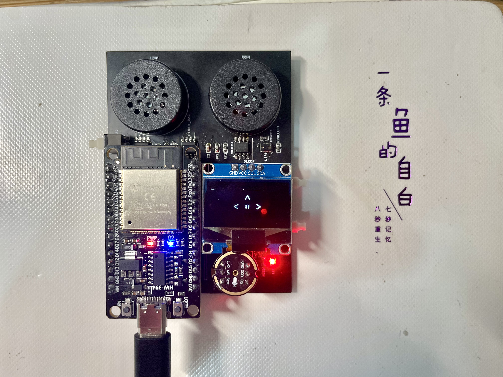

# Project-Zero

### Young people's first embedded system project

The ESP32 Audio Board is a MP3 with strong power. It has a microphone, a 128x64 OLED screen, a stereo speaker, a light sensor, a proximity sensor, an accelerometer, a SD card slot and 3 buttons. 

### How to get one?

1. download the relative PCB documents from [here](https://github.com/wjc74751/Project-Zero/tree/main/PCB) (I will recommend the AD version)
